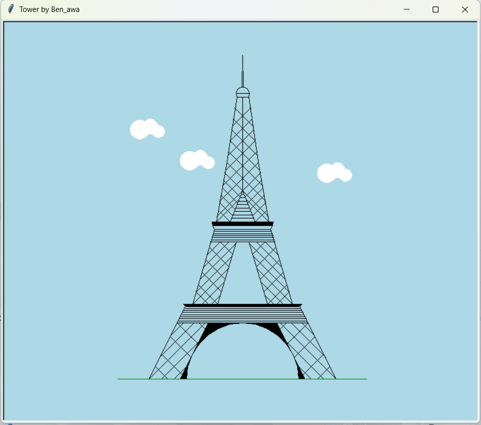

# 基于turtle库的python绘图作业
# python-homework-base-by-Turtle

本项目参照网上埃菲尔铁塔的简化图，

使用python的turtle库和math进行复刻（效果一般）

总体来说，代码大多是对setpos方法和up，down方法的简单重复调用，并没有写一些很难懂的算法（但是堆量导致观感不好）

如果要修改代码的话，建议把中间那些反复调用的代码写成函数

# 图片如下

# 代码见the Eiffel Tower.py

